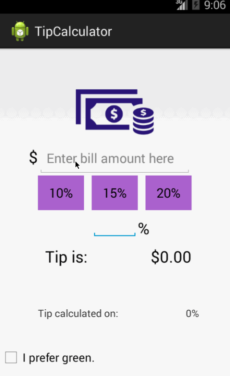

# Tip Calculator for Android
------------------------------------------------------------

## Author: 
	Autumn Victor

## Time To Complete: 
	5 hours
	
------------------------------------------------------------

## User Stories Completed:
- ** Required ** User is displayed the tip of specified percentage for specified entered amount
- ** Required ** User enters the total amount of the transaction
- ** Required ** User can select between tip amounts (i.e 10%, 15%, 20%)
- ** Required ** Upon selecting tip amount, formatted tip value is displayed
- _Optional_ User changes the total amount and updated tip is reflected automatically _based on the last used tip amount_
- _Optional_ User can select custom tip percentage if desired _and updated tip amount is reflected automatically_
- _Optional_ Experiment with trying input widgets _in addition to_ the buttons and/or textviews
- _Optional_ Improve the user interface and experience by using images and/or colors

 